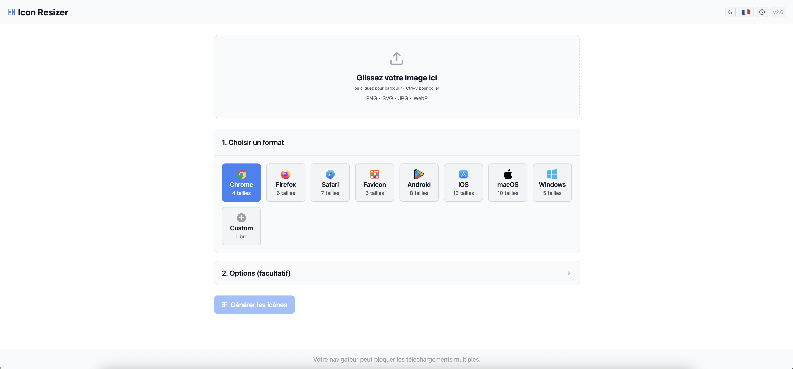
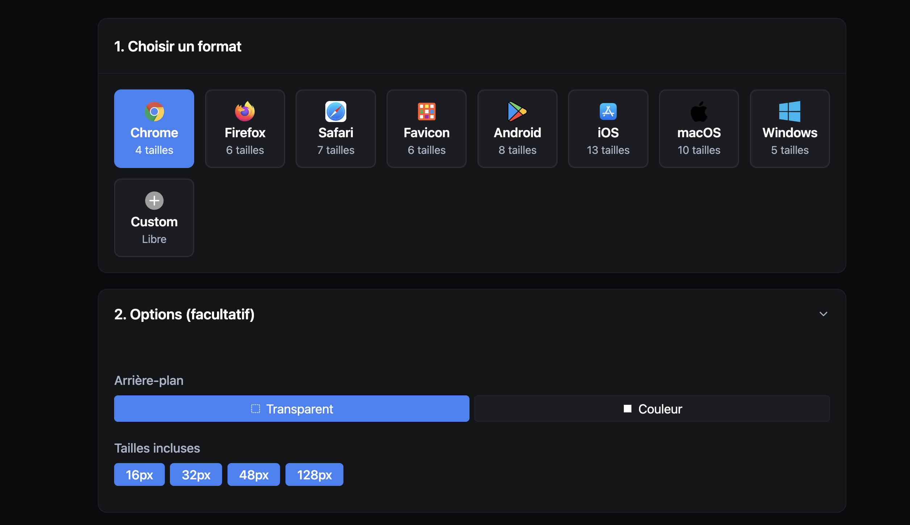
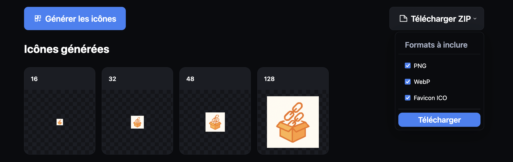
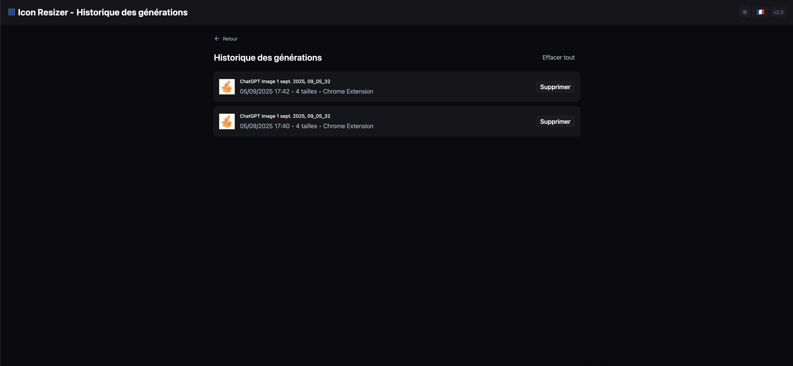

# 🎨 Icon Resizer

A modern web tool to easily resize your icons for all platforms.


## ✨ Features

- 📱 **Presets for all platforms**: Chrome, Firefox, Safari, iOS, Android, macOS, Windows
- 🎯 **Custom size selection**: Enable/disable individual sizes
- 🌐 **Multilingual**: Interface available in French and English
- 🌓 **Dark/Light mode**: Adaptive theme with preference saving
- 📦 **Flexible export**: Download as ZIP with PNG, WebP, and ICO
- 💾 **History**: Keep track of all your generations
- 🎨 **SVG support**: Preserves vector quality
- 🖼️ **Customizable backgrounds**: Transparent or solid color
- 📂 **Custom templates**: Create and save your own configurations

## 🚀 Usage

1. **Drag or select an image** (PNG, JPG, SVG, WebP)
2. **Choose a preset** or create a custom template
3. **Select sizes** to generate (click to enable/disable)
4. **Configure options** (background, format)
5. **Generate icons**
6. **Download** as ZIP or save directly

## 📸 Screenshots

### Main interface


### Light mode


### Size selection


### Generated result


### History


## 🛠️ Technologies

- HTML5/CSS3 with CSS variables for theming
- Vanilla JavaScript (no framework)
- Canvas API for resizing
- File System API for direct saving
- LocalStorage for preferences and history

## 📝 Local Installation

```bash
# Clone the repository
git clone https://github.com/L1L14N-151/icon-resizer.git

# Go to the folder
cd icon-resizer

# Start a local server (Python)
python3 -m http.server 8080

# Or with Node.js
npx serve
```

Open http://localhost:8080

## 🌍 Deployment

This project can be deployed on any static hosting platform:
- Vercel
- Netlify
- GitHub Pages
- Replit

## 📄 License

MIT

## 🤝 Contributing

Contributions are welcome! Feel free to open an issue or pull request.

---

Created with ❤️ to simplify icon creation